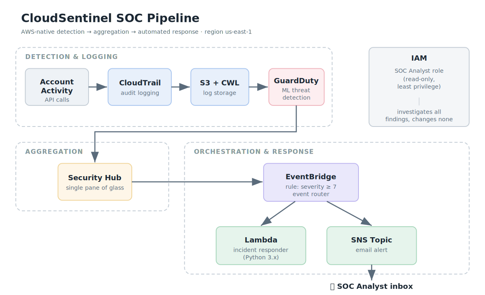
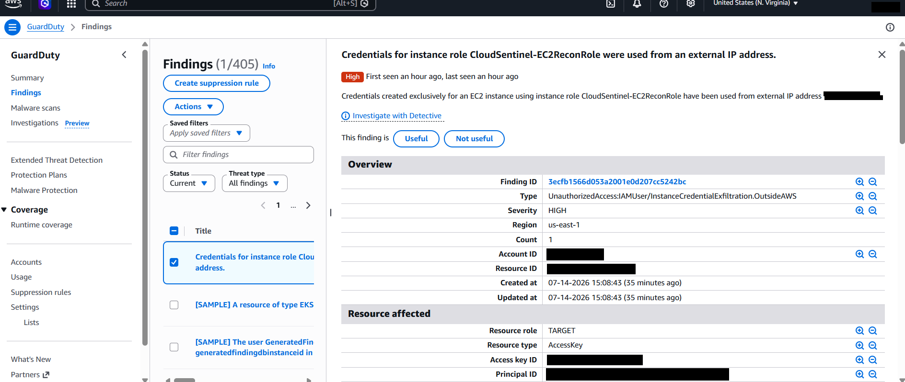
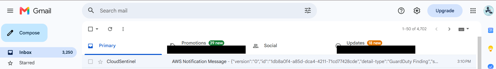

# CloudSentinel — AWS Threat Detection and Response Pipeline

> AWS-native detection, aggregation, alerting, and incident-response logging pipeline built in `us-east-1`.


---

## Executive summary

CloudSentinel is a small-scale AWS security operations pipeline designed to model how cloud security teams collect telemetry, detect high-confidence threats, route findings, and initiate response workflows.

The system uses CloudTrail for audit logging, S3 and CloudWatch Logs for evidence retention, GuardDuty for managed threat detection, Security Hub for findings aggregation, EventBridge for event routing, SNS for analyst notification, and Lambda for structured incident-response logging.

The pipeline was validated in two stages:

1. **Synthetic integration validation** — GuardDuty sample findings were generated to confirm that EventBridge, SNS, and Lambda were wired correctly.
2. **Real detection validation** — an authorized credential-exfiltration scenario was performed against a lab EC2 instance. GuardDuty independently generated a high-severity `UnauthorizedAccess:IAMUser/InstanceCredentialExfiltration.OutsideAWS` finding, which triggered the alerting and response path.

---

## Architecture



### Data flow

```text
AWS account activity
      │
      ├── CloudTrail → S3 + CloudWatch Logs
      │       └── audit evidence and investigation logs
      │
      └── GuardDuty
              └── managed threat detection from AWS telemetry
                      │
                      ├── Security Hub → centralized findings dashboard
                      │
                      └── EventBridge rule: severity >= 7
                              ├── SNS → SOC analyst email alert
                              └── Lambda → incident parsing and response logging
```

CloudTrail and log storage provide the investigation record. GuardDuty is the primary managed detector. Security Hub centralizes visibility. EventBridge routes high-severity findings to response targets.

---

## Design goals

| Goal | Implementation |
|---|---|
| Centralize AWS audit telemetry | CloudTrail with S3 and CloudWatch Logs destinations |
| Use managed cloud threat detection | GuardDuty enabled in `us-east-1` |
| Aggregate security findings | Security Hub dashboard and finding ingestion |
| Automate high-severity response routing | EventBridge rule matching GuardDuty findings with severity `>= 7` |
| Notify a human analyst | SNS email subscription to the SOC analyst inbox |
| Preserve safe response behavior | Lambda runs in simulation/logging mode rather than modifying infrastructure |
| Demonstrate least privilege | Read-only SOC analyst IAM role and scoped EC2 reconnaissance role |

---

## Core components

| Component | Purpose |
|---|---|
| **CloudTrail** | Records AWS API activity for audit and investigation. |
| **S3** | Stores CloudTrail log evidence in a dedicated private bucket. |
| **CloudWatch Logs** | Provides near-real-time log visibility for CloudTrail and Lambda execution output. |
| **GuardDuty** | Detects suspicious cloud activity and assigns severity-scored findings. |
| **Security Hub** | Aggregates findings into a centralized SOC dashboard. |
| **EventBridge** | Routes high-severity GuardDuty findings to downstream response targets. |
| **SNS** | Sends real-time email alerts to the analyst inbox. |
| **Lambda** | Parses GuardDuty findings, classifies severity, identifies affected resources, and logs simulated response actions. |
| **IAM** | Enforces role-based access and least-privilege investigation permissions. |

---

## Validation strategy

CloudSentinel was validated using a two-stage approach so that pipeline functionality and detection fidelity were evaluated separately.

### Stage 1 — Synthetic pipeline validation

GuardDuty sample findings were generated to confirm that the end-to-end integration path worked before relying on live attacker behavior.

| Validation point | Result | Evidence |
|---|---|---|
| GuardDuty generated findings | 404 sample findings, including high and critical severity | `screenshots/11-guardduty-sample-findings.png` |
| Security Hub aggregated findings | Sample findings appeared in the centralized dashboard | `screenshots/12-SecurityHub-sample-findings.png` |
| SNS delivered alert | Email notification received | `screenshots/13-sns-email-alert.png` |
| Lambda executed | Incident output appeared in CloudWatch Logs | `screenshots/14-lambda-cloudwatch-logs.png` |

Sample findings are documented as **integration tests**, not real attack evidence.

### Stage 2 — Real detection validation

A lab EC2 instance was configured with a scoped IAM role and treated as a compromised workload. Initial enumeration produced low-signal reconnaissance activity, but it did not reliably cross the high-severity automation threshold. The scenario was then escalated into a higher-fidelity credential-exfiltration test by using the instance role credentials from an external machine.

| Result | Value |
|---|---|
| GuardDuty finding | `UnauthorizedAccess:IAMUser/InstanceCredentialExfiltration.OutsideAWS` |
| Severity | 8 / 10 — High |
| Region | `us-east-1` |
| Approximate detection time | ~24 minutes |
| Pipeline response | EventBridge matched severity `>= 7`, SNS delivered email, Lambda logged the incident |



*GuardDuty independently produced `UnauthorizedAccess:IAMUser/InstanceCredentialExfiltration.OutsideAWS` at severity 8. Account, resource, and credential identifiers are redacted.*



*The EventBridge rule routed the finding through SNS. The email arrived in the analyst inbox within seconds of the finding being created.*

Additional evidence:

- `screenshots/15-simulation-a-recon-commands.png` — internal enumeration from the compromised instance
- `screenshots/15b-credential-exfiltration-external.png` — instance-role credentials used from an external machine
- `screenshots/18-securityhub-real-finding.png` — the same finding aggregated in Security Hub

Full write-up: [`docs/attack-simulation-report.md`](docs/attack-simulation-report.md)

---

## Design decisions

| Decision | Rationale | Trade-off |
|---|---|---|
| Use GuardDuty as the primary detector | Provides AWS-native managed detection without deploying agents | Less customizable than custom detection engineering |
| Trigger automation only on severity `>= 7` | Reduces alert noise and focuses automation on high-confidence findings | Medium findings require manual review |
| Listen directly to GuardDuty in EventBridge | Simplifies routing and avoids dependency on Security Hub ingestion latency | Security Hub is still used for aggregation, not as the automation source |
| Use SNS email for notification | Simple AWS-native alerting path with minimal setup | Less operationally rich than Slack, PagerDuty, or ServiceNow |
| Keep Lambda in simulation mode | Demonstrates response logic safely without mutating live infrastructure | Does not perform real containment yet |
| Use IAM roles instead of long-term keys on EC2 | Models temporary credential best practice | Requires instance profile setup |
| Validate with sample findings before real attack | Confirms the integration path safely and repeatably | Must be clearly separated from real detection evidence |

Additional detail: [`docs/design-decisions.md`](docs/design-decisions.md)

---

## Detection coverage

| Threat behavior | Source | Status |
|---|---|---|
| GuardDuty high-severity finding routing | EventBridge | Validated with sample and real findings |
| Email alert delivery | SNS | Validated |
| Incident parsing and response logging | Lambda + CloudWatch Logs | Validated |
| EC2 role credential exfiltration | GuardDuty | Validated with real finding |
| Internal AWS enumeration from EC2 | CloudTrail / GuardDuty telemetry | Observed; did not reliably cross severity `>= 7` alone |

See [`docs/detection-coverage.md`](docs/detection-coverage.md).

---

## Incident-response lesson learned

Terminating the compromised EC2 instance did **not** immediately invalidate temporary credentials that had already been exfiltrated. The credentials remained valid until expiry because they were IAM role session credentials, not credentials controlled directly by the instance lifecycle.

A complete response plan must account for:

- role-session revocation,
- credential expiry windows,
- IAM role review,
- CloudTrail investigation,
- and containment of the affected workload.

---

## Repository structure

```text
CloudSentinel-SOC-Project/
├── README.md
├── architecture/
│   ├── cloudsentinel-architecture.png
│   └── cloudsentinel-architecture.mmd
├── docs/
│   ├── attack-simulation-report.md
│   ├── cleanup-and-cost-control.md
│   ├── design-decisions.md
│   ├── detection-coverage.md
│   └── operational-runbook.md
├── eventbridge/
│   └── guardduty_high_severity_rule.json
├── lambda/
│   └── incident_responder.py
└── screenshots/
    └── build and validation evidence
```

---

## Limitations

- Lambda currently performs incident parsing and simulated response logging; it does not automatically quarantine infrastructure.
- EventBridge automation is scoped to GuardDuty findings with severity `>= 7`.
- The deployment is single-region (`us-east-1`). A production deployment would require multi-region event routing or centralized aggregation.
- Security Hub is used for visibility and aggregation; the current automation source is GuardDuty directly.

---

## Cleanup and cost control

Temporary EC2 resources were terminated after validation, and chargeable security services should be reviewed after the project is complete. See [`docs/cleanup-and-cost-control.md`](docs/cleanup-and-cost-control.md).

---

Built by [Chike-dev](https://github.com/Chike-dev) in an AWS lab account. Region: `us-east-1`.
